# Senior Care Platform - System Flow Diagrams

## 1. Complete System Overview Flow

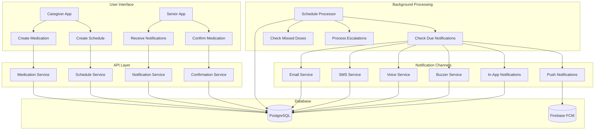

## 2. Schedule Creation and Management Flow

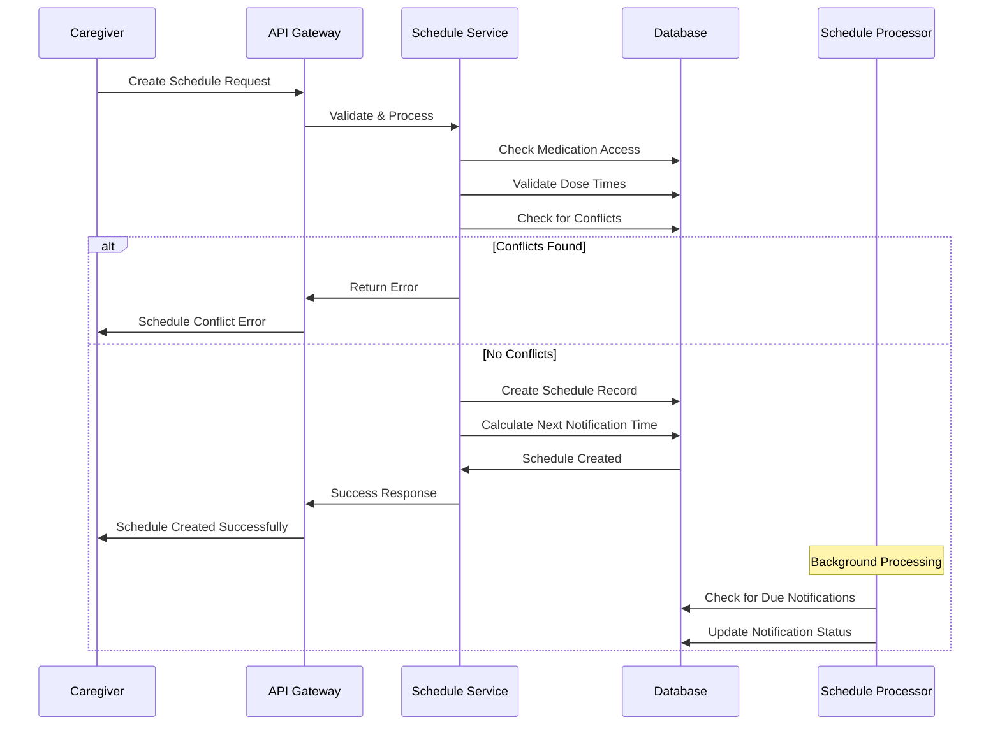

## 3. Notification Processing Flow

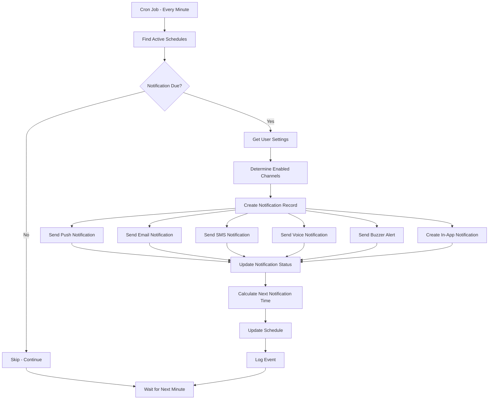

## 4. Missed Dose Detection and Escalation Flow

```mermaid
graph TD
    A[Cron Job - Every 30 Minutes] --> B[Find Schedules with Sent Notifications]
    B --> C[Check for Confirmations]
    C --> D{Confirmation Found?}
    
    D -->|Yes| E[Skip - Dose Taken]
    D -->|No| F[Send Missed Dose Alert]
    
    F --> G[Update Notification Status]
    G --> H[Wait for Next Check]
    
    Note over I: Every Hour
    I[Cron Job - Every Hour] --> J[Find Seniors with Missed Doses]
    J --> K[Count Missed Doses per Medication]
    K --> L[Find Active Caregivers]
    L --> M[Send Escalation Alerts]
    M --> N[Log Alert Results]
    N --> O[Wait for Next Hour]
    
    E --> H
    H --> O
```

## 5. Notification Channel Flow

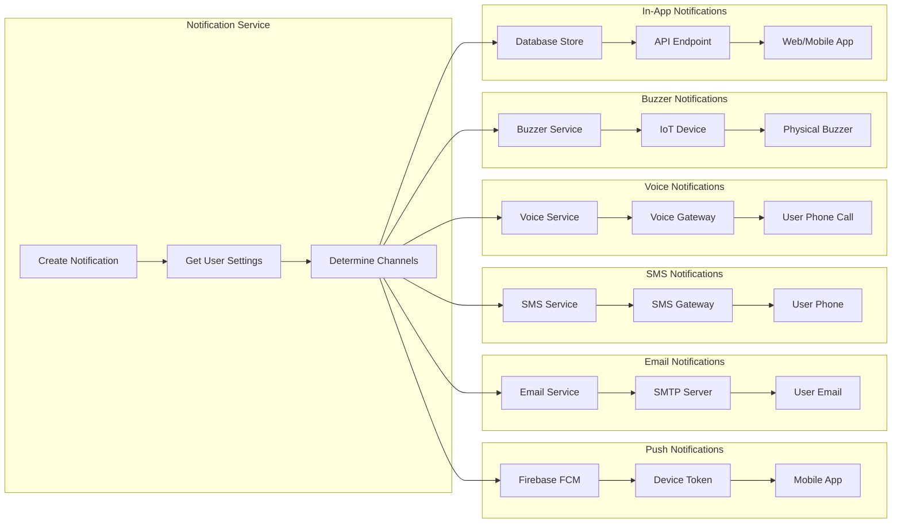

## 6. User Confirmation Flow

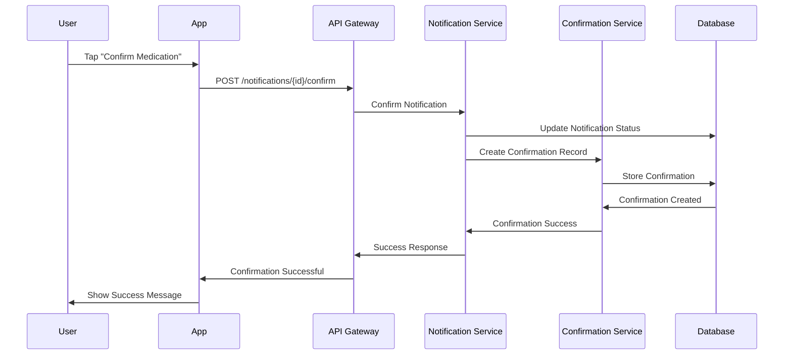

## 7. Schedule Template Flow

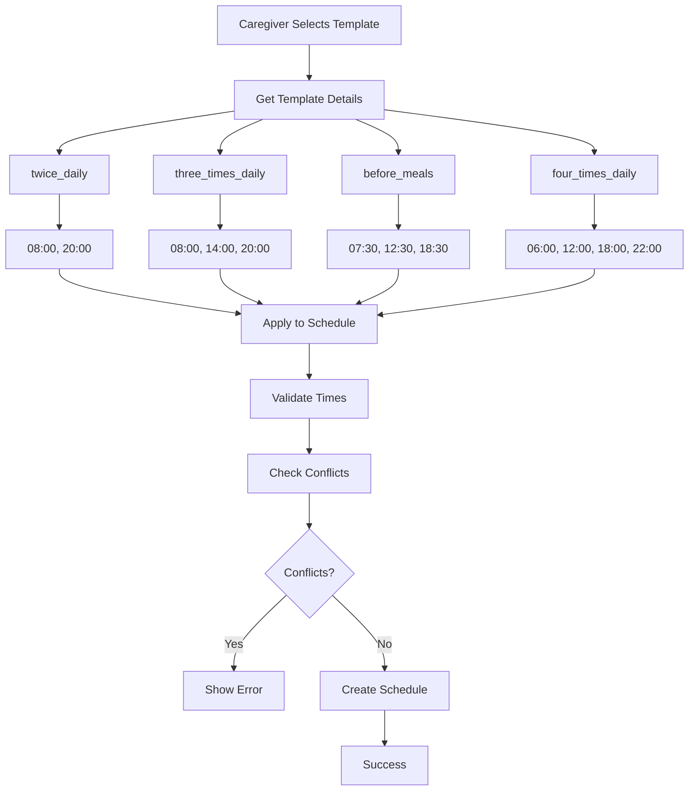

## 8. Error Handling and Retry Flow

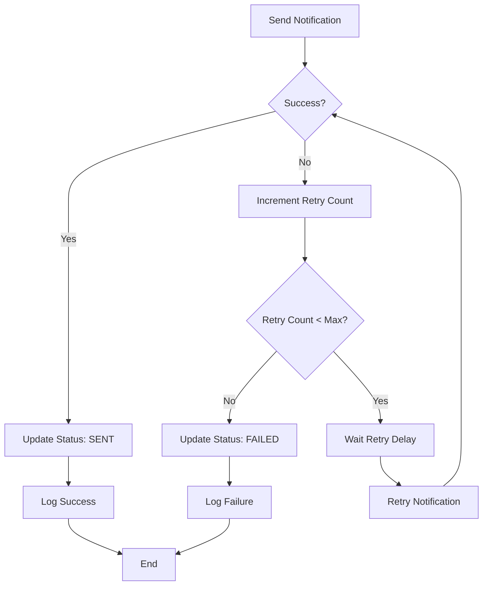

## 9. Database Relationships Flow

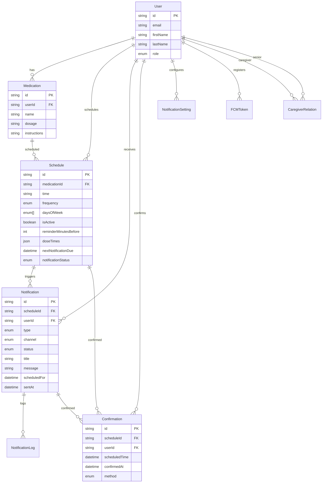

## 10. Performance Monitoring Flow

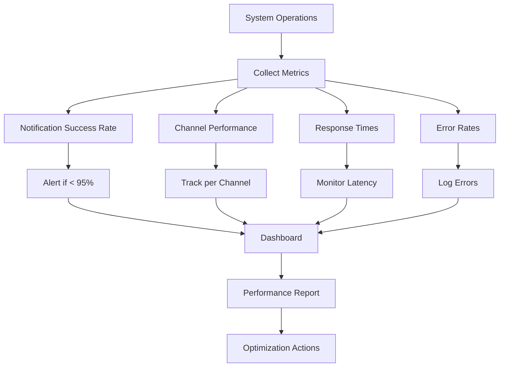

## 11. Security and Authentication Flow

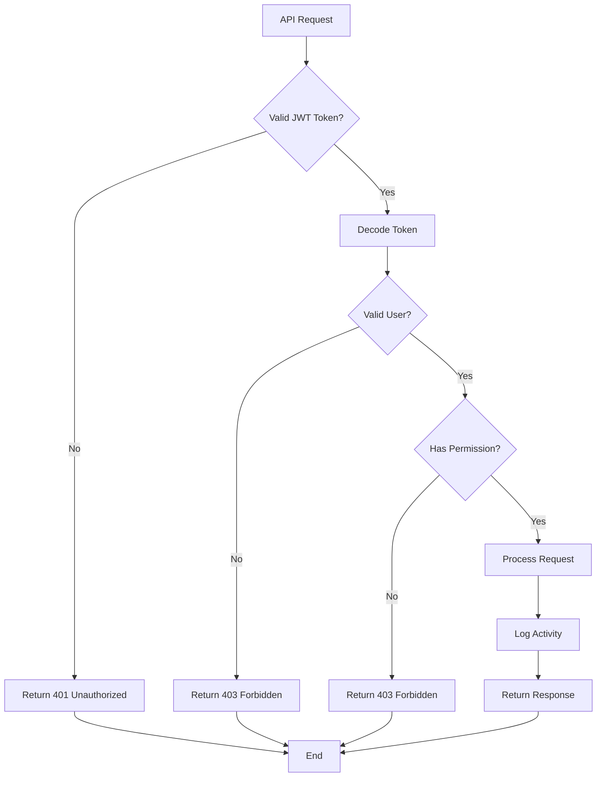

## 12. Deployment and Scaling Flow

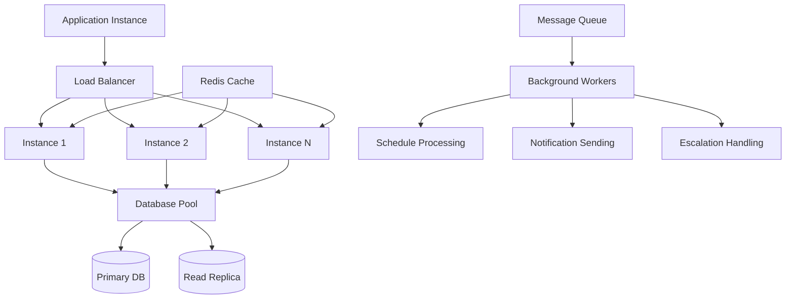

These flow diagrams provide a comprehensive visual representation of how your scheduling and notification system works, from user interactions to background processing and system architecture.
